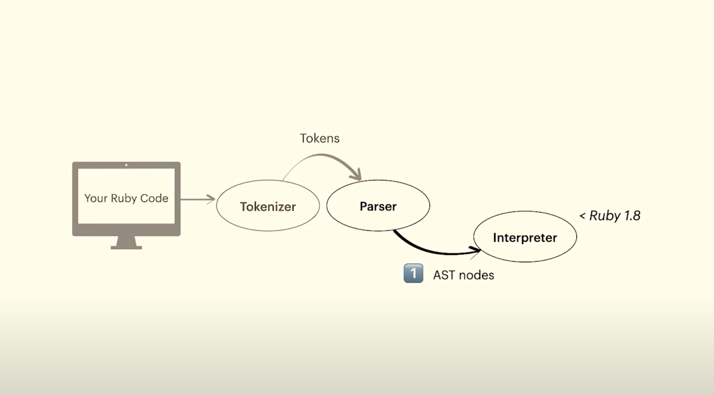
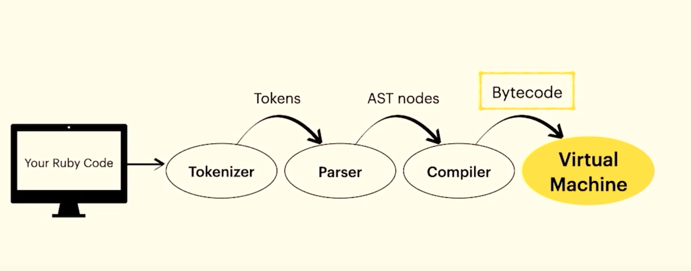

https://www.youtube.com/watch?v=ySuMOEVLaMw&t=2s
https://www.youtube.com/live/6loKD2LXxbc?si=EVAF5Cq9JZtKhXoD&t=826

# Interpreting the AST directly

With the AST at hand, we can interpret it to run our program.

## Considerations

- Simple, but slow
- How RUby <= 1.8 worked
- https://github.com/MatheusRich/ruby/blob/f48ae0d10c5b586db5748b0d4b645c7e9ff5d52e/eval.c#L2982

# Compiling

- How AST becomes bytecode
https://github.com/MatheusRich/ruby/blob/7178593558080ca529abb61ef27038236ab2687d/prism_compile.c#L242

# Interpreting bytecode

- Executing bytecode
