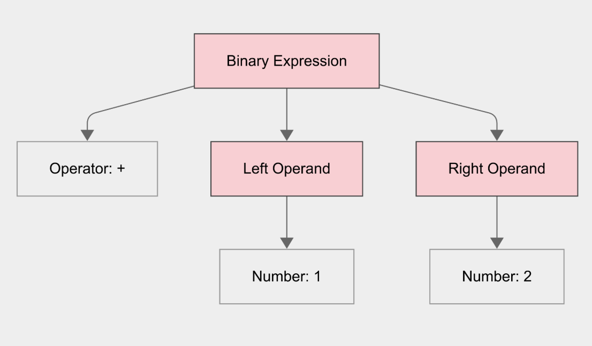
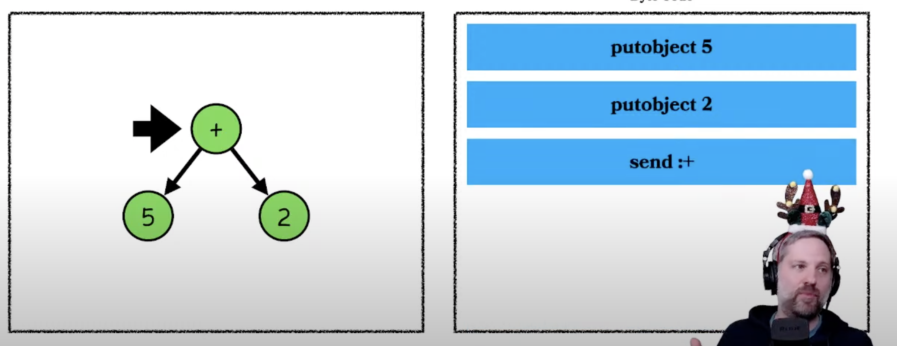

https://www.youtube.com/watch?v=ySuMOEVLaMw&t=2s
https://www.youtube.com/live/6loKD2LXxbc?si=EVAF5Cq9JZtKhXoD&t=826

# Interpreting the AST directly

With the AST at hand, we can interpret it to run our program. TO do that is
really simple, we just need to check the type of each node and run the appropriate
code.

```rb
def self.interpret(ast)
  case ast[:type]
  in :number
    ast[:value]
  in :binary
    left = interpret(ast[:left])
    right = interpret(ast[:right])

    left.send(ast[:operator], right)
  end
end
```

There you go. We just built a very simple interpreter!


This is exactly how Ruby <= 1.8 worked. Let's check some examples from the source code directly

<!--
{
  type: :literal,
  literal: 42
}
 -->

```c
// eval.c
static VALUE
rb_eval(self, n)
    VALUE self;
    NODE *node;
{
  again:
    switch (nd_type(node)) {
      // ...
      case NODE_LIT:
        result = node->nd_lit;
        break;
      // ...
    }
}
```

how if's work

```c
// eval.c
static VALUE
rb_eval(self, n)
    VALUE self;
    NODE *node;
{
  again:
    switch (nd_type(node)) {
      // ...
      case NODE_IF:
        if (RTEST(rb_eval(self, node->nd_cond))) {
          node = node->nd_body;
        }
        else {
          node = node->nd_else;
        }
        goto again;
      // ...
    }
}
```

let's check boolean operators like `&&`:

```c
// eval.c
static VALUE rb_eval(VALUE self, NODE *node) {
  again:
    switch (nd_type(node)) {
      // ...
      case NODE_AND:
        result = rb_eval(self, node->nd_1st);
        if (!RTEST(result)) break;
        node = node->nd_2nd;
        goto again;
      // ...
    }
}
```

This is why you can do:

```rb
false && puts(1 + "1")
```

and it won't print anything. we only evaluate the right side if the left side is truthy.

## Considerations

- Simple, but slow
  - https://craftinginterpreters.com/chunks-of-bytecode.html#why-not-walk-the-ast
- How RUby <= 1.8 worked
- https://github.com/MatheusRich/ruby/blob/f48ae0d10c5b586db5748b0d4b645c7e9ff5d52e/eval.c#L2982

# Compiling

The talk could have ended in the last section, but that interpreter has a big
problem: it's very slow. Walking the AST like that is very slow because the
information is spread all over the place. We need to jump around the memory
a lot to get the information we need.



Modern CPUs are much faster than they can pull data from memory. So, they
optimize that by having caches. If everything they need is in the cache, they
can run much faster. Like, 100x faster.

So, we need to optimze our memory layout to make it easier for the CPU to pull
the data it needs. We'll do that by flattening the AST into an array. This array
will be a series of instructions that a VM can run. This is called bytecode.



- How AST becomes bytecode
https://www.youtube.com/watch?v=6loKD2LXxbc&t=1045s
https://github.com/MatheusRich/ruby/blob/7178593558080ca529abb61ef27038236ab2687d/prism_compile.c#L242
- https://craftinginterpreters.com/jumping-back-and-forth.html#logical-operators

```c
static inline void
pm_compile_and_node(rb_iseq_t *iseq, const pm_and_node_t *node, const pm_node_location_t *location, LINK_ANCHOR *const ret, bool popped, pm_scope_node_t *scope_node)
{
    LABEL *end_label = NEW_LABEL(location->line);

    PM_COMPILE_NOT_POPPED(node->left);
    if (!popped) PUSH_INSN(ret, *location, dup);
    PUSH_INSNL(ret, *location, branchunless, end_label);

    if (!popped) PUSH_INSN(ret, *location, pop);
    PM_COMPILE(node->right);
    PUSH_LABEL(ret, end_label);
}

static void
pm_compile_node(rb_iseq_t *iseq, const pm_node_t *node, LINK_ANCHOR *const ret, bool popped, pm_scope_node_t *scope_node)
{
  // ...
  switch (PM_NODE_TYPE(node)) {
    // ...
    case PM_AND_NODE:
        // a and b
        // ^^^^^^^
        pm_compile_and_node(iseq, (const pm_and_node_t *) node, &location, ret, popped, scope_node);
        return;
  }
}
```


# Interpreting bytecode

- Executing bytecode

## You can see the bytecode

```sh
ruby -e "1 + 2" --dump=insns
```

## Fast-path optimizations

- We generate less intructions.
- Less instructions to run is faster
- More instructions can fit in the cache (faster again)

- 20% faster with a simple fast-path optimization
