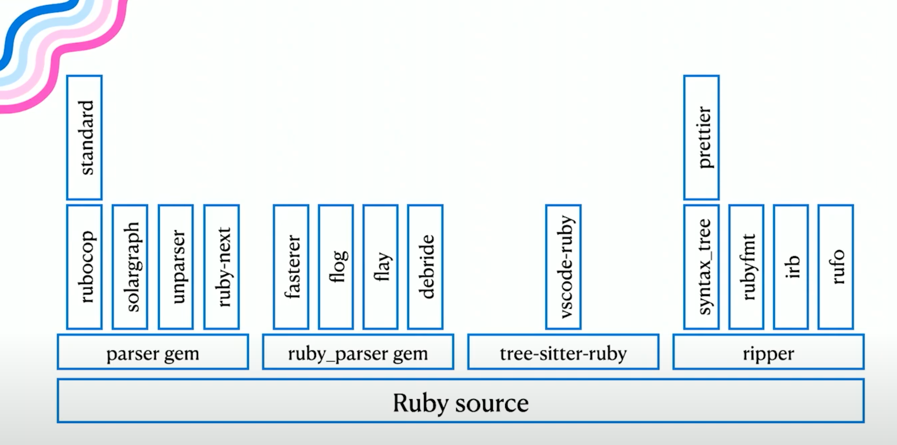

# Parsing

## Introduction

> If you don't know how compilers work, then you don't know how computers work. - Steve Yegge

We want to understand how the Ruby interpreter reads our code and executes it.
To start that journey, let's think about how _we_ read text.

> Ruby: A Programmer's Best Friend

When I this, I startfrom left to right, top to bottom. My brain automatically
splits the sentence by space into words. It also pays attention to the accents and punctuation.

```rb
tokens = %w[Ruby : A Programmer ' s Best Friend]
```

That happens super fast, and automatically. When it comes to understand its
meaning, we use the tokens and see their relation and structure.

For example, the colon lets me know that the word "Ruby" is the subject of the
sentence, and what comes after that is describing it.

the `'s` tells me that what comes after (best friend) is a possessive of the
previous word (programmer). etc

But note that not everything that is correct grammatically makes sense. For
example:

> Colorless green ideas sleep furiously

While this sentence follow grammar rules, it doesn't make sense. ALthough some
might argue that it sounds poetic, thus having a meaning. That's a topic for a
different discussion.

With programming it's the same thing. The computer will read your sentence
(code), split it into tokens, check their structure and relation, and interpret
their meaning (or error if it doesn't make sense).

```rb
def meaning_of = 42
puts meaning_of(:life, :universe, :everything)
```

---

So there are 3 steps to this process:

1. **Lexing**: Splitting the code into tokens
2. **Parsing**: Checking the structure and relation of the tokens
3. **Interpretation/Execution**: Understanding the meaning of the code and running it

In Ruby, that's roughly divided like this

1. Lexer & Parsing: Prism
2. Interpretation/Compilation: YARV (vm)
3. Execution: YARV (vm) + YJIT

---

## Writing a parser

Let's imagine a simple language. It only let's you write single digit numbers.

```rb
program → NUMBER

NUMBER  → 0 | 1 | 2 | 3 | 4 | 5 | 6 | 7 | 8 | 9
```

This is the grammar. It tells us that a program is a number, and a number is any
digit from 0 to 9.

So this program is valid:

```rb
5
```

and this one is not:

```rb
hello
```

Let's to write a parser for that. To keep thing simple, I'll skip the tokenizer by just spliting the input by space.

```rb
module Tokenizer
  def self.call(input)
    input.split
  end
end
```

Now let's write the parser:

```rb
class Parser
  def initialize(tokens)
    @tokens = tokens
  end

  def call
    program
  end

  def program
    number
  end

  def number
    token = advance
    raise "EOF" if token.nil?
    raise "Expected a number, got #{token}" unless token.match?(/\A\d\z/)

    {type: :number, value: token.to_i}
  end

  private

  def advance
    @tokens.shift
  end
end
```

Note that we're already doing some decisions about our language. All numbers are
integers. If we wanted, we could use `.to_f` instead to make them floats.

### Sum

Let's make it a bit more interesting by adding addition:

```rb
program → term

term    → NUMBER
        | NUMBER "+" NUMBER
```

That let's us sum two numbers. Let's change it to allow any number of sums:

```rb
program → term
term    → NUMBER ("+" NUMBER)*
```

here's the parser

```rb
class Parser
  def initialize(tokens)
    @tokens = tokens
  end

  def call
    program
  end

  def program
    term
  end

  def term
    expr = number

    while matches?("+", "-")
      operator = advance
      expr2 = number

      expr = {type: :binary, operator:, left: expr, right: expr2}
    end

    expr
  end

  def number
    token = advance
    raise "EOF" if token.nil?
    raise "Expected a number, got #{token}" unless token.match?(/\A\d\z/)

    {type: :number, value: token.to_i}
  end

  private

  def matches?(*types)
    types.any? { it === @tokens.first }
  end

  def advance
    @tokens.shift
  end
end
```

So, something simple as 1 - 2 + 3 would look like this:

```rb
{type: :binary,
 operator: "+",
 left: {type: :binary, operator: "-", left: {type: :number, value: 1}, right: {type: :number, value: 2}},
 right: {type: :number, value: 3}}
```

Which is pretty verbose. THat's why people often sue s-expressions to represent AST. So the same thing would look like this:

```rb
(+ (- 1 2) 3)
```

As a tree, it would look like this:

```
    +
   / \
  -   3
 / \
1   2
```

Let's try adding multiplication and division. The initial thought could be just adding something to the `term` rule:

```rb
def term
  expr = number

  while matches?("+", "-", "*", "/")
    operator = advance
    expr2 = number

    expr = {type: :binary, operator:, left: expr, right: expr2}
  end

  expr
end
```

But this would be wrong, because not all math operation have the same precedence. Here's what we're getting

```
         /
        / \
       *   4
      / \
     -   3
    / \
   1   2
```

Because of PEMDAS, multiplication and division should be done before addition and subtraction. THis is the correct tree:

```
        -
       / \
      1   /
         / \
        *   4
       / \
      2   3
```

To fix that, we need to add a new rule for multiplication and division:

```rb
program → term
term    → factor ( ( "+" | "-" ) factor )*
factor  → NUMBER ( ( "/" | "*" ) NUMBER )*
NUMBER  → 0 | 1 | 2 | 3 | 4 | 5 | 6 | 7 | 8 | 9
```

In the code, it would look like this:

<%= File.read "interpreter/3.rb" %>

But, just for good measure, let's add parenthesis:

```rb
program → term
term    → factor ( ( "+" | "-" ) factor )*
factor  → primary ( ( "/" | "*" ) primary )*
primary → NUMBER | "(" term ")"
NUMBER  → 0 | 1 | 2 | 3 | 4 | 5 | 6 | 7 | 8 | 9
```

In the code, it would look like this:

<%= File.read "interpreter/4.rb" %>

Note how we're using recursion to handle the parenthesis. This is why this kind of algorithm is called a recursive descent parser.

---

Why is this important?

- Understand how the ruby parser works
- precedence rules impact on real code:

Example 1:

```rb
a = false || true
b = false or true
```

It may look similar, but `or` has lower precedence than `||`, so the first one is parsed as

```rb
a = (false || true)
# returns true, and assigns true to a
```

While the second one is parsed as

```rb
(b = false) or true
# assigns false to b, and returns true
```

Example 2:

```rb
1..10.each { puts it }
# raises NoMethodError: undefined method `each' for Integer
```

because it is parsed as

```rb
1..(10.each { puts it })
```

to help the parser, you can use parenthesis:

```rb
(1..10).each { puts it }
# prints 1 to 10
```

## Parsers aren't just for compilers

You might be thinking "I'm not writing a compiler, why should I care about
parsers?". But in reality, we deal with parsers all the time. Many of the tools
we use on a daily basis depend on parsers:

- irb
- Rails
  - to get file and line numbers for a specific test (https://github.com/rails/rails/pull/51006/files)
- Rubocop
- standard
- packwerk
- erb_lint

- ruby-lsp
- solargraph

- scout_apm

- console1984

- flay
- flog
- churn
- reek
- fasterer

And there were several parsers available for Ruby:

- Ripper
- parser gem
- ruby_parser gem
- tree-sitter

This leads to a fractured ecosystem, where several tools use different parsers, which might behave differently, and have different AST representations.



So, when Ruby adds new syntax (like endless method definitions), every
maintainer of these tools has to update their parser to support it. So you won't
get IDE support for the new syntax, formatters, linters, and tools to measure
code complexity don't know how to handle it,.

Luckily, Shopify worked on a new parser for Ruby, called Prism, which is now
used by several tools including Ruby itself.

Prism is a handwritten recursive descent parser, that was built with error
tolerance in mind. We should expect better tools for Ruby (Ruby-LSP has been
improving the DX extremely), with better and more accurate error messages.

Also more performance, who doesn't want that?
- https://github.com/rails/rails/pull/49438
- https://eregon.me/blog/2024/10/27/benchmarking-ruby-parsers.html
  > When parsing and walking, Prism is 12% faster than RubyVM::AbstractSyntaxTree and 12x as fast as the Parser gem!
  >
  > When parsing to C structs, Prism is 2.56x as fast as parse.y. Who thought parsing Ruby in C could be made > more than twice as fast?
  >
  > When compiling to bytecode, Prism is 1.46x as fast as parse.y, speeding up boot times.

So, if you are thinking about creating a gem that needs to parse Ruby code, check out prism.
I've built one myself. HEre's code_picture, a gem that generates a visual representation of your code:


